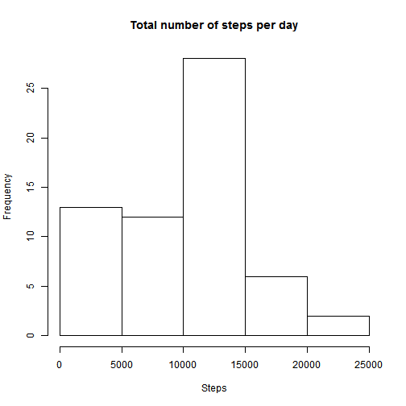
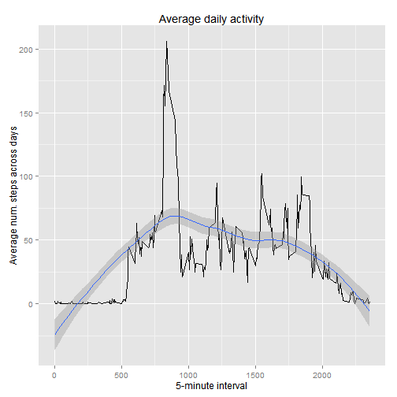
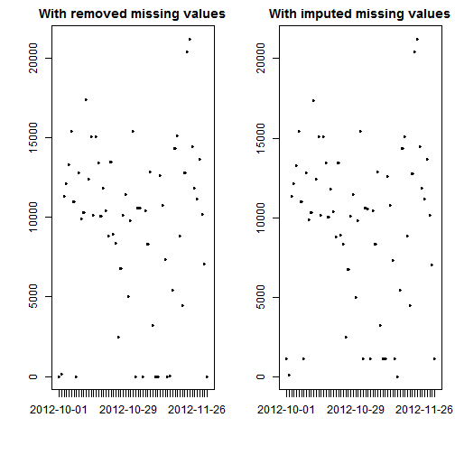
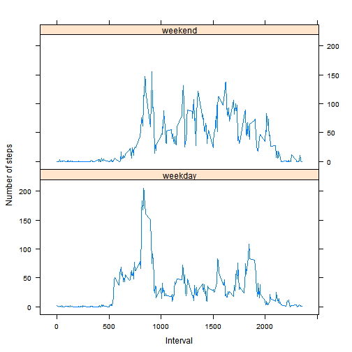

# Reproducible Research: Peer Assessment 1
The data for the assigment is the [activity monitoring dataset](https://d396qusza40orc.cloudfront.net/repdata%2Fdata%2Factivity.zip) from the course's web site.

The variables included in this dataset are:
* **steps:** number of steps taking in a 5-minute interval (missing values are coded as NA);
* **date:** the date on which the measurement was taken in YYYY-MM-DD format;
* **interval:** identifier for the 5-minute interval in which measurement was taken.

The dataset is stored in a comma-separated-value (CSV) file and there are a total of 17,568 observations in this dataset.

## Loading and preprocessing the data
The initial loading of the data is achieved through the read.csv function as follows:


```r
# We will encounter a few harmless warnings generated by R in the code later, so turn them off here.
options(warn=-1)
# Load the data.
df <- read.csv("activity.csv")
str(df)
```

```
## 'data.frame':	17568 obs. of  3 variables:
##  $ steps   : int  NA NA NA NA NA NA NA NA NA NA ...
##  $ date    : Factor w/ 61 levels "2012-10-01","2012-10-02",..: 1 1 1 1 1 1 1 1 1 1 ...
##  $ interval: int  0 5 10 15 20 25 30 35 40 45 ...
```

## What is mean total number of steps taken per day?
**Note:** for this part of the assignment, we are ignoring the missing values in the dataset.

### A histogram of the total number of steps taken each day
The following is the code to transform the original data frame and generate the histogram:

```r
library(plyr)
df2 <- ddply(df, .(date), summarise, totalStepsPerDay = sum(steps, na.rm=TRUE))
hist(df2$totalStepsPerDay, main="Total number of steps per day", xlab="Steps")
```

 

### The mean and median total number of steps taken per day
The following calculates and reports the **mean** total number of steps taken per day:

```r
mean(df2$totalStepsPerDay, na.rm=TRUE)
```

```
## [1] 9354
```

The following calculates and reports the **median** total number of steps taken per day:

```r
median(df2$totalStepsPerDay, na.rm=TRUE)
```

```
## [1] 10395
```

## What is the average daily activity pattern?

### Time series plot of the average number of steps taken
The average daily activity pattern is illustrated via a time series plot (i.e. type = "l") of the 5-minute interval (x-axis) and the average number of steps taken, averaged across all days (y-axis):

```r
library(plyr)
df2 <- ddply(df, .(interval), summarise, averNumStepsAcrossAllDays = mean(steps, na.rm=TRUE))
library(ggplot2)
ggplot(data=df2, aes(x=interval, y=averNumStepsAcrossAllDays)) + geom_line() + geom_smooth(method=loess) + xlab("5-minute interval") + ylab("Average num. steps across days") + ggtitle("Average daily activity")
```

 

### Which 5-minute interval, on average across all the days in the dataset, contains the maximum number of steps?
This question is answered using the code below:

```r
df2[which.max(df2$averNumStepsAcrossAllDays),]$interval
```

```
## [1] 835
```

## Imputing missing values
It is important to note there are a number of days/intervals where there are missing values (coded as NA). The presence of missing days may introduce bias into some calculations or summaries of the data.

### The total number of missing values in the dataset
The below calculates and reports the total number of missing values in the dataset (i.e. the total number of rows with NA's):

```r
length(which(is.na(df$steps)))
```

```
## [1] 2304
```
A visual inspection of the input file reveals that only the column with the number of steps contains missing values, which allows us to avoid having to worry about any missing dates or 5-minute interval identifiers.

### A strategy for filling in the missing values
To fill in the missing values in the dataset, the selected strategy is to use the median value for the number of steps for a given day:

```r
library(plyr)
df2 <- ddply(df, .(interval), transform, steps=ifelse(is.na(steps), median(steps, na.rm=TRUE), steps))
```
The dataset created by this code is equal to the original dataset but with the missing data filled in, which is illustrated bellow by comparing a quick summary of the original dataset vs. that of the imputed dataset:

#### A quick summary of the original dataset


```r
str(df)
```

```
## 'data.frame':	17568 obs. of  3 variables:
##  $ steps   : int  NA NA NA NA NA NA NA NA NA NA ...
##  $ date    : Factor w/ 61 levels "2012-10-01","2012-10-02",..: 1 1 1 1 1 1 1 1 1 1 ...
##  $ interval: int  0 5 10 15 20 25 30 35 40 45 ...
```
#### A quick summary of the imputed dataset


```r
str(df2)
```

```
## 'data.frame':	17568 obs. of  3 variables:
##  $ steps   : int  0 0 0 47 0 0 0 0 0 34 ...
##  $ date    : Factor w/ 61 levels "2012-10-01","2012-10-02",..: 1 2 3 4 5 6 7 8 9 10 ...
##  $ interval: int  0 0 0 0 0 0 0 0 0 0 ...
```

### A histogram of the total number of steps taken each day, with imputation

```r
df3 <- ddply(df2, .(date), summarise, totalStepsPerDay = sum(steps))
hist(df3$totalStepsPerDay, main="Total number of steps per day", xlab="Steps")
```

 
### The mean total number of steps taken per day, with imputation
The following calculates and reports the **mean** total number of steps taken per day, with the NA's imputed:

```r
mean(df3$totalStepsPerDay)
```

```
## [1] 9504
```

### The median total number of steps taken per day, with imputation
The following calculates and reports the **median** total number of steps taken per day, with the NA's imputed:

```r
median(df3$totalStepsPerDay)
```

```
## [1] 10395
```

### Do the re-calcuated values differ from the estimates from the first part of the assignment?
The re-calculated values differ, between the original dataset and the imputed dataset, although not drastically.

### What is the impact of imputing missing data on the estimates of the total daily number of steps?
In this particular case, it appears that imputation did not affect the overall analysis drastically (whether positively or negatively). The code and diagram below illustrate this conclusion by comparing the total steps per day calculated with the original dataset vs. that calculated with the imputed dataset:


```r
dfWithRemovedMissingValues <- ddply(df, .(date), summarise, totalStepsPerDay = sum(steps, na.rm=TRUE))
par(mfrow = c(1, 2), mar=c(5, 4,2, 1))
with(dfWithRemovedMissingValues, plot(date, totalStepsPerDay, main="With removed missing values"))
with(df3, plot(date, totalStepsPerDay, main="With imputed missing values"))
```

 

The differences are most noticeable around these dates: 2012-10-01 and 2012-10-31/2012-11-15.

## Are there differences in activity patterns between weekdays and weekends?
**Note:** the dataset with the filled-in missing values is used for this part.

### Distinguish between weekdays and weekends
The code below creates a new factor variable in the dataset with two levels – “weekday” and “weekend” indicating whether a given date is a weekday or weekend day:


```r
# Load the input dataset and convert the dates to the Date type
df <- read.csv("activity.csv", stringsAsFactors=FALSE)
df$date <- as.POSIXct(df$date, format="%Y-%m-%d")
    
# Impute the missing values based on the median for given 5-minute intervals.
library(plyr)
df2 <- ddply(df, .(interval), transform, steps=ifelse(is.na(steps), median(steps, na.rm=TRUE), steps))

# Append the day type column to distinguish between weekdays and weekends.
df2$dayType <- ifelse(weekdays(as.Date(df2$date)) %in% c('Saturday','Sunday'), "weekend", "weekday");

# Make day type be a factor.
df2 <- transform(df2, dayType = factor(dayType))
```

### Illustrate weekdays vs. weekends
The idea here is to make a panel plot containing a time series plot (i.e. type = "l") of the 5-minute interval (x-axis) and the average number of steps taken, averaged across all weekday days or weekend days (y-axis).

The following prepares a data frame for the plot:

```r
# Calculate average numbers of steps across all days
# for the weekdays
dfWeekdays <- ddply(subset(df2, df2$dayType=="weekday"), .(interval, dayType), summarise, averNumStepsAcrossAllDays = mean(steps))
# for the weekends
dfWeekends <- ddply(subset(df2, df2$dayType=="weekend"), .(interval, dayType), summarise, averNumStepsAcrossAllDays = mean(steps))
# merge back into a single dataset
dfAll <- merge(dfWeekdays, dfWeekends, all=TRUE)
```

The following creates the actual plot:

```r
library(lattice)
xyplot(averNumStepsAcrossAllDays ~ interval | dayType, data = dfAll, layout=c(1, 2), xlab="Interval", ylab="Number of steps", type="l")
```

 

This concludes the exploration of the activity monitoring dataset.
